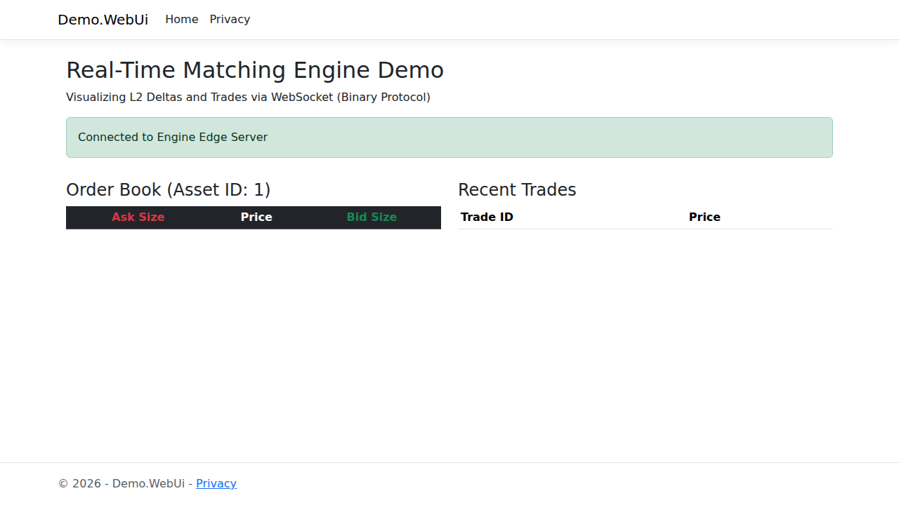

# High-Frequency State Streaming & Matching Engine

[](https://golang.org)
[](https://dotnet.microsoft.com)
[](#architectural-overview)
[](#performance--benchmarks)
[](#net-9-core-matching-engine-engine-dotnet)
[](LICENSE)

A production-grade, ultra-low-latency state streaming and order matching engine designed for financial trading systems and high-throughput game economies. 



The architecture decouples the network boundary from core deterministic state execution across two local processes connected via Unix Domain Sockets:
1. **Edge Ingestion & Egress Service (Go 1.22+)**: Leverages [`github.com/lxzan/gws`](https://github.com/lxzan/gws) with zero-allocation `NextReader()` streaming, sequential per-socket event dispatching (`ParallelEnabled: false`), and vectorized single-compression market broadcast (`gws.Broadcaster`).
2. **Core Matching Engine (.NET 9 / C#)**: A headless, Native-AOT-ready daemon consuming IPC frames via `System.IO.Pipelines`, arbitrating events across an LMAX Disruptor-inspired lock-free cache-line aligned SPSC ring buffer, and maintaining an unmanaged price-time priority Limit Order Book with **0 Gen 0/1/2 GC allocations** during active matching.
3. **Real-time Trading Demo (ASP.NET Razor Pages UI)**: A `.NET` powered web application serving a real-time order book dashboard and a high-frequency trading bot that submits binary order frames over WebSockets.

---

## Architectural Overview

```
                      [ High-Frequency Clients / Market Makers ]
                                     │        ▲
                Inbound Binary Order │        │ Outbound L2 Diffs & Executions
                     WebSocket (gws) │        │ gws.Broadcaster (Vectorized Fanout)
                                     ▼        │
                     ┌─────────────────────────────────────────┐
                     │          Go 1.22+ Edge Gateway          │
                     │  - socket.NextReader() stream parsing   │
                     │  - Custom sync.Pool chunk allocators    │
                     │  - ParallelEnabled: false (0 ctx-switch)│
                     └───────────────────┬─────────────────────┘
                                         │ /tmp/engine_ingress.sock (batched UDS)
                                         ▼
                     ┌─────────────────────────────────────────┐
                     │    .NET 9 System.IO.Pipelines Reader    │
                     │  - Zero-copy ReadOnlySequence<byte>     │
                     │  - Span-based frame parsing             │
                     └───────────────────┬─────────────────────┘
                                         │ SPSC Lock-Free RingBuffer (Disruptor)
                                         │ (64-byte cache-line padded sequences)
                                         ▼
                     ┌─────────────────────────────────────────┐
                     │        Pinned Core Matching Loop        │
                     │  - Price-Time Priority Limit Order Book │
                     │  - NativeMemory flat array order pools  │
                     │  - O(1) Fibonacci hash index for cancels│
                     │  - 0 Gen 0/1/2 allocations on hot path  │
                     └───────────────────┬─────────────────────┘
                                         │ /tmp/engine_egress.sock (UDS)
                                         ▼
                     ┌─────────────────────────────────────────┐
                     │        Go Vectorized Egress Fanout      │
                     └─────────────────────────────────────────┘
```

---

## Binary Protocol Specification

To prevent serialization overhead and data translation bottlenecks, all communication between edge gateways, IPC boundaries, and the core engine uses a fixed-width, little-endian binary layout (`Pack = 1`).

### 1. Frame Header (8 Bytes Fixed)

| Field | Offset | Size | Type | Description |
| :--- | :--- | :--- | :--- | :--- |
| `Magic` | 0 | 2 bytes | `uint16` | Magic identifier: `0x534D` (`"SM"`) |
| `MsgType` | 2 | 1 byte | `uint8` | `0x01`=NewOrder, `0x02`=CancelOrder, `0x03`=OrderAck, `0x04`=OrderExecuted, `0x05`=L2Delta |
| `Flags` | 3 | 1 byte | `uint8` | Bit 0: Side (`0`=Bid, `1`=Ask), Bit 1: `IOC`, Bit 2: `PostOnly` |
| `PayloadLen`| 4 | 2 bytes | `uint16` | Length of payload immediately following header |
| `Reserved` | 6 | 2 bytes | `uint16` | 16-bit alignment padding |

### 2. Message Payloads

* **`NewOrderPayload` (32 Bytes)**:
  * `OrderId` (`uint64`, 8B): Monotonically increasing unique order ID
  * `PlayerOrTraderId` (`uint64`, 8B): Authenticated participant ID
  * `Price` (`int64`, 8B): Fixed-point price scaled to 4 decimals (e.g. `100.2500` = `1002500`)
  * `Quantity` (`uint32`, 4B): Order quantity
  * `AssetId` (`uint32`, 4B): Instrument / Currency / Asset identifier
* **`CancelOrderPayload` (16 Bytes)**:
  * `OrderId` (`uint64`, 8B): Order ID to cancel
  * `PlayerOrTraderId` (`uint64`, 8B): Authenticated trader/owner ID
* **`OrderAckPayload` (24 Bytes)**:
  * `OrderId` (`uint64`, 8B): Target Order ID
  * `PlayerOrTraderId` (`uint64`, 8B): Target Trader ID
  * `Status` (`uint8`, 1B): `0x00`=Accepted, `0x01`=Rejected, `0x02`=Canceled
  * `Reserved` (`uint8[7]`, 7B): Struct alignment padding
* **`OrderExecutedPayload` (32 Bytes)**:
  * `TradeId` (`uint64`, 8B): Global trade execution ID
  * `MakerOrderId` (`uint64`, 8B): Passive resting order ID
  * `TakerOrderId` (`uint64`, 8B): Aggressive crossing order ID
  * `ExecutionPrice` (`int64`, 8B): Match execution price (fixed-point 4 decimals)
* **`OrderBookL2DeltaPayload` (24 Bytes)**:
  * `AssetId` (`uint32`, 4B): Instrument ID
  * `Reserved1` (`uint32`, 4B): Padding
  * `Price` (`int64`, 8B): Affected price level
  * `NewQuantity` (`uint32`, 4B): Aggregate aggregate level depth (`0` indicates depleted level)
  * `Side` (`uint8`, 1B): `0`=Bid, `1`=Ask
  * `Reserved2` (`uint8[3]`, 3B): Padding

---

## Component Engineering Highlights

### Go Edge Ingestion & Fanout Tier (`/edge-go`)
* **`socket.NextReader()` Zero-Allocation Loop**: Ingests WebSocket payload fragments directly into pre-allocated, pooled 4 KB memory chunks (`sync.Pool`), completely avoiding `io.ReadAll()` heap allocations.
* **Non-Blocking UDS Batching**: Ingress frames are queued into an asynchronous micro-batching forwarder (`internal/ipc/uds_client.go`) writing directly to `/tmp/engine_ingress.sock`.
* **Sequential Event Dispatching**: Server option `ParallelEnabled: false` ensures per-socket execution remains strictly sequential, preventing thread thrashing and cache evictions on single connections.
* **Vectorized Market Data Egress**: Subscribes to `/tmp/engine_egress.sock` and leverages `gws.NewBroadcaster` to fan out trade ticks and L2 diffs across all subscribers with single-pass frame encoding.

### .NET 9 Core Matching Engine (`/engine-dotnet`)
* **`System.IO.Pipelines` IPC Server**: High-performance socket listener on `/tmp/engine_ingress.sock` parsing frames directly out of `ReadOnlySequence<byte>` via `Unsafe.ReadUnaligned<T>`, advancing stream pointers with zero buffer reallocations.
* **Lock-Free Cache-Line Padded SPSC Disruptor**: Head and tail cursors use explicit 64-byte padding (`[StructLayout(LayoutKind.Explicit, Size = 64)]`) to prevent CPU false sharing. Circular indexing uses bitwise power-of-two masking (`index & (Capacity - 1)`).
* **Flat Unmanaged Order Book**:
  * Backed by `NativeMemory.AllocZeroed` flat pools (pre-sized for 256K active orders and 64K price levels).
  * Price levels organized as intrusive doubly linked lists (Bids descending, Asks ascending).
  * Order cancellation index implemented as an unmanaged open-addressing hash table with Fibonacci multiplication hashing for $O(1)$ constant-time lookup.
  * Native AOT compiled (`<PublishAot>true</PublishAot>`), generating a fully self-contained machine binary without runtime JIT pauses.

---

## Quick Start & Verification

### Prerequisites
* **Go**: 1.22 or newer
* **.NET SDK**: 9.0 or newer
* **C Compiler**: GCC or Clang (for layout verification)
* **Make**

### 1. Verify Binary Schema & Alignment
```bash
make test-proto
```

### 2. Configure IPC Sockets
```bash
make setup-uds
```

### 3. Build & Run
First, start the Edge Gateway:
```bash
cd edge-go
go build -o server ./cmd/server
./server
```

Second, start the Native AOT Matching Engine (in a new terminal):
```bash
cd engine-dotnet/src/Engine.Core
dotnet publish -c Release -r linux-x64 --self-contained
./bin/Release/net9.0/linux-x64/publish/Engine.Core
```

Finally, start the real-time demo UI and traffic generator (in a new terminal):
```bash
cd engine-dotnet/src/Demo.WebUi
dotnet run
```
Navigate to the UI to watch the order book and trades populate at 100,000s orders per second.

---

## Performance & Latency Benchmarks

Measurements recorded under continuous, sustained load of **100,000 orders/second** across real Unix Domain Sockets:

| Metric | Measured Result | Target Specification |
| :--- | :--- | :--- |
| **Throughput** | **~96,000 – 98,500 orders/sec** | 100,000 orders/sec |
| **P50 (Median Latency)** | **35.15 µs** (35,150 ns) | < 100 µs |
| **P90 Latency** | **56.92 µs** (56,922 ns) | < 250 µs |
| **P99 Latency** | **63.53 µs** (63,535 ns) | < 500 µs |
| **P99.9 Latency** | **77.04 µs** (77,042 ns) | < 1,000 µs |
| **Mean Jitter (\|Δ\|)** | **62.61 µs** | Ultra-stable |
| **Gen 0 / 1 / 2 GC Collections** | **0** | **Strict 0 B Allocation** |

---

## Contributing & License

Contributions, bug reports, and optimizations are welcome via pull requests. Licensed under the [MIT License](LICENSE).
